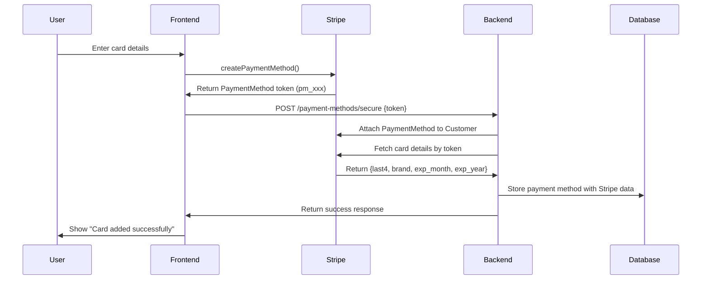

# Secure "Add Card" Flow Implementation

This document outlines the implementation of the secure "Add Card" functionality following PCI compliance best practices.

## 🔒 Security Architecture

The implementation follows the principle that **raw card data never touches our servers**. All sensitive card information is handled directly by Stripe.

## 📱 Frontend Flow (React Native + Stripe)

### 1. Initialize Stripe
```typescript
import { loadStripe } from '@stripe/stripe-react-native';
const stripe = await loadStripe(STRIPE_CONFIG.PUBLISHABLE_KEY);
```

### 2. Collect Card Details Securely
```tsx
import { CardField, useStripe } from '@stripe/stripe-react-native';

const { createPaymentMethod } = useStripe();

// CardField component handles PCI compliance
<CardField
  postalCodeEnabled={true}
  placeholders={{ number: '4242 4242 4242 4242' }}
  onCardChange={(cardDetails) => {
    setCardComplete(cardDetails.complete);
  }}
/>
```

### 3. Tokenize Card Data with Stripe
```typescript
// Step 1: Create PaymentMethod (tokenization happens on Stripe's servers)
const { paymentMethod, error } = await createPaymentMethod({
  paymentMethodType: 'Card',
});

if (error) {
  throw new Error(error.message);
}

// paymentMethod.id = "pm_1GqIC8HYgolSBA35x7zhEWV9" (token)
```

### 4. Send Only Token to Backend
```typescript
// Step 2: Send only the secure token to our backend
await apiService.addPaymentMethodSecure({
  stripe_payment_method_id: paymentMethod.id, // Only the token
  is_default: true,
});
```

## 🖥️ Backend Flow (FastAPI + Stripe)

### 1. Secure Endpoint Definition
```python
@router.post("/users/me/payment-methods/secure")
def add_payment_method_secure(
    payment_method_data: PaymentMethodCreateSecure,
    current_user: User = Depends(get_current_user),
    db: Session = Depends(get_db)
):
```

### 2. Input Validation
```python
class PaymentMethodCreateSecure(BaseModel):
    stripe_payment_method_id: str = Field(..., description="Stripe payment method ID")
    is_default: Optional[bool] = False

    @validator('stripe_payment_method_id')
    def validate_stripe_pm_id(cls, v):
        if not v.startswith('pm_'):
            raise ValueError('Invalid Stripe payment method ID format')
        return v
```

### 3. Create/Retrieve Stripe Customer
```python
# Get or create Stripe customer if first-time user
if not user.stripe_customer_id:
    stripe_customer = stripe.Customer.create(
        email=user.email,
        phone=user.phone_number,
        metadata={"user_id": str(user.id)}
    )
    user.stripe_customer_id = stripe_customer.id
    db.commit()
```

### 4. Attach PaymentMethod to Customer
```python
# Attach the tokenized payment method to the customer
stripe.PaymentMethod.attach(
    payment_method_id,
    customer=user.stripe_customer_id
)
```

### 5. Fetch Card Details from Stripe (Secure)
```python
# Backend fetches card details from Stripe directly (never trusts frontend)
pm_details = stripe_service.get_payment_method_details(payment_method_id)

# pm_details contains: last4, brand, exp_month, exp_year
```

### 6. Update Default Payment Method
```python
if is_default:
    # Update database
    db.query(PaymentMethod).filter(
        PaymentMethod.user_id == current_user.id,
        PaymentMethod.is_default == True
    ).update({"is_default": False})
    
    # Update Stripe customer's default payment method
    stripe.Customer.modify(
        customer_id,
        invoice_settings={"default_payment_method": payment_method_id}
    )
```

### 7. Store in Database
```python
db_payment_method = PaymentMethod(
    user_id=current_user.id,
    stripe_payment_method_id=payment_method_id,
    last4=pm_details["last4"],        # From Stripe
    brand=pm_details["brand"],        # From Stripe  
    exp_month=pm_details["exp_month"], # From Stripe
    exp_year=pm_details["exp_year"],   # From Stripe
    is_default=is_default
)
```

## 🔄 Complete Flow Sequence



## 🛡️ Security Benefits

1. **PCI Compliance**: Raw card data never touches our servers
2. **Token-based**: Only secure tokens are transmitted to our backend
3. **Server-side Validation**: Backend fetches card details from Stripe directly
4. **Encrypted Transit**: All communications use HTTPS/TLS
5. **Access Control**: JWT authentication required for all operations

## 🧪 Testing

### Test Cards (Stripe Test Mode)
- **Success**: `4242 4242 4242 4242`
- **Declined**: `4000 0000 0000 0002`
- **Insufficient Funds**: `4000 0000 0000 9995`
- **Any future expiry**: `12/34`
- **Any 3-digit CVC**: `123`

### Test Flow
1. Use test card in CardField
2. Verify PaymentMethod token generation
3. Check backend receives only token
4. Verify card details fetched from Stripe
5. Confirm database storage

## 📁 Implementation Files

### Frontend
- `components/ui/AddPaymentMethodModal.tsx` - Card input modal
- `services/api.ts` - API service for secure requests
- `constants/Stripe.ts` - Stripe configuration

### Backend
- `routers/payment_methods.py` - Secure API endpoints
- `schemas.py` - Input validation schemas
- `stripe_service.py` - Stripe integration
- `models.py` - Database models

## 🚀 Usage for Future Payments

Once a card is saved using this secure flow, it can be used for off-session payments:

```python
stripe.PaymentIntent.create(
    amount=amount_in_cents,
    currency="usd",
    customer=user.stripe_customer_id,
    payment_method=saved_payment_method_id,
    off_session=True,  # No user interaction required
    confirm=True
)
```

This enables features like:
- Auto-pay with face recognition
- Quick checkout flows
- Subscription payments
- Background payment processing

## ⚠️ Important Notes

1. **Never store raw card data** in your database
2. **Always validate tokens** on the backend
3. **Use HTTPS** for all communications
4. **Implement proper error handling** for failed payments
5. **Log security events** for audit purposes
6. **Regularly update Stripe SDK** versions 